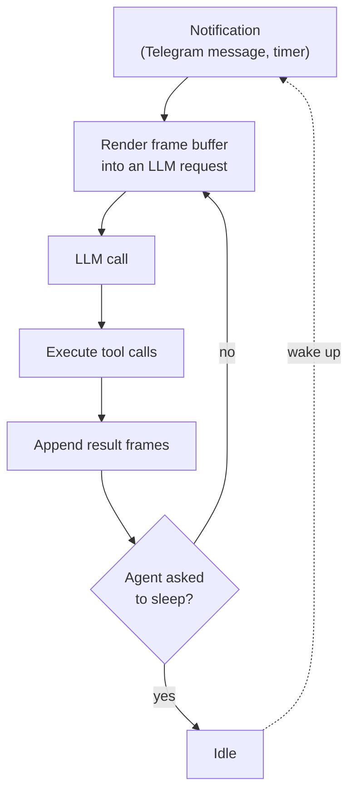

# Kiri

Kiri is a self-driving LLM agent that lives in Telegram. Unlike a chatbot, which wakes up only to answer
a message, Kiri runs a continuous loop: it decides on its own what to do next, opens and closes "apps",
writes to and reads from long-term memory, and goes to sleep when there is nothing left to do.

Everything the agent perceives is a **frame**. Everything it does is a **tool call**. That's the whole model.

> **Status:** personal project, used in production by exactly one person. Interfaces change without notice.

## Contents

- [How it works](#how-it-works)
- [What's in the box](#whats-in-the-box)
- [Getting started](#getting-started)
- [Configuration](#configuration)
- [Deployment](#deployment)
- [Project layout](#project-layout)
- [Development](#development)
- [License](#license)

## How it works

The agent engine runs a tick loop. Each tick renders the current frame buffer into a chat completion
request, sends it to the configured LLM, and executes whatever tools the model called. The results
become new frames, and the loop continues until the agent decides to sleep.



**The frame buffer** is a bounded, ordered window of everything the agent can currently see. Frames carry
arbitrary tags and attributes, and are rendered into the LLM request as XML-ish blocks — the agent is told
explicitly not to depend on any particular tag or ordering. When the buffer overflows its hard limit,
the oldest frames are dropped. Frame kinds:

| Frame | Purpose |
| --- | --- |
| `StaticDataFrame` | Fixed content, rendered as written |
| `DynamicDataFrame` | Re-rendered every tick, always reflects current state |
| `ToolCallFrame` | A tool invocation and its result |
| `ReasoningFrame` | Model reasoning blocks, preserved across ticks |
| `NativeWebSearchFrame` | Provider-native web search results |

**Apps** are the agent's capabilities, grouped into namespaces it can open and close at will
(`apps.open("calendar")`). Each open app contributes its tools to the registry for the next tick, which
keeps the tool list small and the context focused. Tools are declared as ordinary Kotlin functions:

```kotlin
@Component
@AgentToolNamespace("files")
class FilesApp(private val temporaryFiles: TemporaryFilesService) : AgentApp("files") {

    @AgentToolMethod(description = "Create or overwrite a text file")
    suspend fun write(name: String, content: String): String {
        temporaryFiles.create(name, content.toByteArray(Charsets.UTF_8))
        return "Wrote '$name' (${content.length} chars)."
    }

    override fun getAvailableAgentToolMethods() = listOf(::write)
}
```

`AgentToolScanner` reflects over these, `AgentToolParameterMapper` derives the JSON schema from the
Kotlin signature, and `ToolCallExecutor` dispatches calls back. No schema is written by hand.

**Memory** is key/value pairs retrieved by semantic similarity of their keys, stored in PostgreSQL via
pgvector. The agent chooses for itself when to `memorize`, `query` and `forget` — nothing is written
automatically.

## What's in the box

**Agent apps**

- `telegram` — read and send messages, react, browse chat history
- `calendar` — events with RFC 5545 recurrence rules
- `scratchpad` — free-form notes that persist across ticks
- `files` — read/write/edit temporary text files
- `image` — image generation
- `svg` — author SVG and render it to PNG (Apache Batik)

**LLM providers** — Anthropic, OpenAI and Google GenAI, behind one `ChatCompletionService` interface
with a shared request DSL. Extended thinking, provider-native web search and prompt caching are
supported where the provider supports them.

**Admin UI** — a Next.js panel at `/kiri` for engine control, model and prompt settings, live frame
buffer inspection over SSE, memory browsing, Telegram chat management, broadcasts, donations and
token usage stats.

**Telegram bot** — the user-facing surface, plus `/start`, `/stop`, `/clear`, `/version` and Telegram
Stars payment commands.

## Getting started

### Prerequisites

- JDK 21 (Gradle downloads it automatically if your default JDK is a different version)
- Node.js 20+
- PostgreSQL 16+ with the [`pgvector`](https://github.com/pgvector/pgvector) extension
- A Telegram bot from [@BotFather](https://t.me/botfather)

### 1. Start a database

```bash
docker compose -f docker-compose.dev.yml up -d
```

This starts PostgreSQL with pgvector on `localhost:5432` using the credentials the app expects by
default (`kiri` / `kiri` / database `kiri`). Flyway creates the schema on first boot.

### 2. Configure

Create `local/application-local.yml` — it is gitignored and overrides anything in
`src/main/resources/application.yml`:

```yaml
app:
  security:
    # openssl rand -base64 32
    encryptionKeyBase64: your-base64-key
  auth:
    telegram:
      botUsername: your_bot_username
  integration:
    telegram:
      botId: 123456789
      apiKey: your-telegram-bot-token
```

`encryptionKeyBase64` must be a valid AES key (16, 24 or 32 bytes, Base64-encoded). It encrypts
provider API keys at rest, so changing it later makes stored keys unreadable.

### 3. Run

```bash
./gradlew bootRun          # backend on :8080
cd admin-ui && npm ci && npm run dev        # admin UI on :3000/kiri
```

### 4. Grant yourself access

The admin UI authenticates through the Telegram login widget, and every endpoint requires the `ADMIN`
role. Two things are not automatic:

- **Register the login domain with BotFather.** Telegram only renders the widget for a domain the bot
  owns: send `/setdomain` to [@BotFather](https://t.me/botfather) and point it at `localhost`. Without
  this the login page shows "Bot domain invalid".
- **Create the first user.** Nothing seeds one. Message the bot once so your Telegram user lands in the
  database, then:

  ```sql
  insert into main.users (id, role) values (<your-telegram-user-id>, 'OWNER');
  ```

  `OWNER` implies `ADMIN` through the role hierarchy, and only `OWNER` can manage other users.

### 5. Give the agent a system prompt

Open <http://localhost:3000/kiri>, log in, then:

1. **Integrations** — add at least one provider API key. Memory currently embeds through OpenAI
   (`text-embedding-3-large`), so an OpenAI key is needed for `memory.*` tools regardless of which
   provider drives the agent.
2. **Agent** — pick a model and write the instructions. **This starts out empty**, and an agent with no
   instructions will not behave sensibly. This is the system prompt: describe who the agent is, that its
   only output is tool calls, and that frames arrive in arbitrary order.
3. **Engine** — start the engine.

## Configuration

Configuration is split in two on purpose.

**Infrastructure settings** live in YAML and are read at startup:

| Key | Description |
| --- | --- |
| `app.security.encryptionKeyBase64` | AES key for encrypting secrets at rest |
| `app.integration.telegram.botId` / `.apiKey` | Bot credentials |
| `app.auth.telegram.botUsername` / `.callbackUrl` | Telegram login widget |
| `app.frontend.host` / `.basePath` / `.cookiesDomain` | Where the admin UI is served |
| `app.backend.host` / `.basePath` | Where the API is served |
| `spring.datasource.*` | Database connection |

Spring imports `./local/application-local.yml` and `./config/application.yml` if present, both optional.

**Runtime settings** live in the database and are editable from the admin UI without a restart —
provider API keys (encrypted), the selected model, the system prompt, reasoning and token budgets,
Telegram behaviour toggles, and payment texts. Keys are namespaced: `agent.enabled`,
`agent.engine.*`, `apps.telegram.*`, `integration.openai.apiKey` (and `.anthropic`,
`.google.genAi`), `payments.*`.

## Deployment

```bash
./gradlew packageDeployment
```

Produces `deployment/build/distributions/docker-compose-<version>.zip` containing the backend jar,
the frontend sources, Dockerfiles and an nginx config that serves the UI at `/kiri` and the API at
`/kiri/api`. Unpack it on the target host and:

```bash
CONFIG_PATH=/path/to/application.yml docker compose up -d --build
```

The compose file expects an externally managed PostgreSQL instance and terminates plain HTTP on the
published port, so put it behind your own TLS terminator — the auth cookies are `Secure` and will not
survive a plain-HTTP origin.

The mounted config must set at least:

```yaml
server:
  servlet:
    context-path: /kiri/api   # nginx forwards the full path; without this every API call 404s
app:
  frontend:
    host: https://your.domain
    cookiesDomain: your.domain
  auth:
    telegram:
      callbackUrl: https://your.domain/kiri/api/auth/telegram/callback
spring:
  datasource:
    url: jdbc:postgresql://your-db-host:5432/kiri
```

The defaults for all of these point at `localhost`, so leaving them out sends your login redirect to the
wrong place. Remember to `/setdomain` your production domain with BotFather too.

## Project layout

```
src/main/kotlin/space/davids_digital/kiri/
├── agent/
│   ├── engine/       Tick loop, event bus, lifecycle hooks
│   ├── frame/        Frame buffer, frame types, rendering
│   ├── tool/         Tool registry, reflection-based scanner, executor
│   ├── memory/       Memory tools
│   ├── app/          Agent apps (telegram, calendar, files, image, svg, scratchpad)
│   └── notification/ Wake-up sources
├── bot/telegram/     Bot commands and update handling
├── integration/      Anthropic, OpenAI, Google GenAI, Telegram clients
├── llm/              Provider-agnostic chat completion model and request DSL
├── model/            Domain models
├── orm/              JPA entities, repositories, MapStruct mappers, ORM services
├── rest/             Controllers, DTOs, SSE, auth
├── security/         Role annotations and checks
└── service/          Application services

admin-ui/             Next.js 15 admin panel (React 19, SCSS modules)
deployment/           Docker Compose overlay and packaging
```

## Development

```bash
./gradlew :build      # compile and test the backend
./gradlew test        # tests only
./gradlew build       # everything, including the admin UI and the deployment zip
cd admin-ui && npm run build   # production build of the admin UI
```

Migrations are Flyway SQL files in `src/main/resources/db/migration`; add new ones as `V<n>__name.sql`
and never edit an applied migration. Entity/DTO mapping goes through MapStruct (kapt), so a clean build
is needed after changing a mapper interface.

See [CONTRIBUTING.md](CONTRIBUTING.md) for code style and pull request conventions.

## License

MIT — see [LICENSE](LICENSE).
